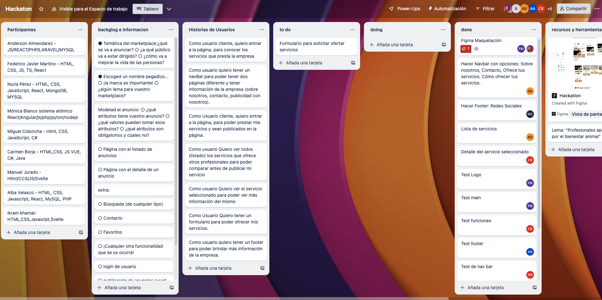

# Hackaton Factoria-F5 
¡Bienvenido/a al Hackatón Factoria-F5 Summer Edition '23!  En este desafío la empresa  empresa thoughtworks nos ha propuesto el reto de construir una Marketplace, el equipo ha decidido embarcarse en la emocionante misión de construir una plataforma web única y especializado en servicios para mascotas. Nuestra meta es mejorar la vida de los dueños de mascotas, proporcionándoles acceso fácil y confiable a una variedad de servicios para el cuidado y bienestar de sus adorables compañeros peludos.


## PetPro Assist
¡Bienvenido/a a nuestro proyecto "PetPro Assist" para servicios de mascotas! donde ofrecemos una variedad de servicios para mascotas, incluyendo peluquería, veterinario, spa, paseadoras, guardería y mucho más. Nuestro público objetivo son los dueños de mascotas que buscan soluciones y servicios de calidad para el cuidado de sus compañeros peludos.

## Construyendo Nuestro Marketplace
En este repositorio, encontrarás el código fuente de nuestro proyecto y el proceso de desarrollo durante el hackatón F5. Hemos modelado cuidadosamente los anuncios y definido los atributos esenciales para una experiencia de usuario intuitiva y satisfactoria. A medida que avanzamos, continuaremos añadiendo más funcionalidades emocionantes para mejorar aún más la experiencia de nuestros usuarios.

¡Únete a nosotros en esta emocionante aventura de construir un marketplace para servicios de mascotas que marque la diferencia!

¡Esperamos que te unas a nuestro equipo y contribuyas a hacer realidad este emocionante proyecto! Siéntete libre de explorar el código, hacer sugerencias y ayudarnos a llevar nuestro marketplace para servicios de mascotas a un nivel superior.

## Organización
En nuestro emocionante viaje para crear esta increíble marketplace, comenzamos sumergiéndonos en la comprensión del sitio web que anhelábamos construir. Realizamos una lluvia de ideas y posteriormente dimos vida a nuestras visiones mediante un detallado wireframe, visualizando cómo sería nuestra plataforma en acción.

Para garantizar una organización óptima y un trabajo fluido, adoptamos la metodología ágil Kanban. Federico asumió el rol de Product Owner, mientras que Nuria ejerció como Scrum Master. Como equipo, nos dividimos en developers y nos asignamos tareas utilizando Trello, una herramienta esencial que nos permitió gestionar nuestras responsabilidades y seguir el progreso de cada etapa.

Nuestro repositorio se convirtió en nuestro tesoro codificado, y como un grupo cohesionado, nos enfocamos en desarrollar la aplicación de manera iterativa y progresiva. Cada miembro aportó sus habilidades únicas a diferentes partes de la plataforma, manteniéndonos en constante comunicación para asegurarnos de que todos estuviéramos alineados con los objetivos y plazos.

Con la filosofía ágil en mente, celebramos reuniones periódicas de retrospectiva para reflexionar sobre nuestros avances. Aprendimos de nuestros aciertos y ajustamos el enfoque cuando lo necesitamos, lo que nos permitió superar desafíos y alcanzar resultados extraordinarios.

Utilizamos Leaflet como nuestra biblioteca para mapas, un recurso esencial para mostrar los servicios ofrecidos por categoría en diferentes ubicaciones. De esta manera, los clientes pueden encontrar fácilmente los servicios que necesitan según su ubicación, ¡haciendo que su experiencia en la plataforma sea excepcional!

Estamos increíblemente orgullosos de nuestro proyecto y del equipo que formamos. Cada uno de nosotros ha contribuido con dedicación y pasión, lo que se refleja en el resultado final de nuestra plataforma. Y no olvidemos mencionar: Trello fue nuestro fiel aliado en la gestión, llevándonos de manera ágil y efectiva hasta el emocionante lanzamiento de nuestra marketplace.

Gracias a todos por esta emocionante travesía juntos. ¡El futuro se ve brillante y estamos ansiosos por seguir creciendo y mejorando en cada paso del camino!

Aquí un pedazo de nuestra organización en el trello, donde teniamos las historias de usuarios, información de los participantes, herramientas y podiamos ver en que estaba trabajando cada participante.



## Funcionalidades Principales
Algunas de nuestras funcionalidades principales incluyen:
- Listado de anuncios de servicios para mascotas.
- Detalles completos de cada servicio ofrecido.
- Búsqueda personalizada por tipo de servicio, mapa con ubicación y otros criterios relevantes.
- Búsqueda por servicio a través de ubicación geográfica para hacer el match con el profesional seleccionado.


## :hammer:Tecnologías y Herramientas Utilizadas
<div align=""> 
  
  


</div>

## Instalación

- Clona o descarga el repositorio del proyecto en tu máquina local.
```
https://github.com/miguelcidoncha/PetPro-Assist.git 
```
- Abre el archivo index.html en tu navegador web preferido y disfruta de PetPro Assist.

### Para los tests
- Una vez clonado el repositorio en la terminal de tu editor de código con el proyecto.
```
npm install
```
- Para ejecutarlos
```
npm run test
```
## Figma
[Imagen del figma de baja fidelidad movil](/assets/images/bajaFifelidadMovil.png)
<br>
[Imagen del figma de baja fidelidad desktop](/assets/images/bajaFidelidadDesktop.png)
<br>
[Imagen del figma atomos, moleculas y organismos](/assets/images/atomicdesign.png)
<br>
[Imagen del figma prototipo movil](/assets/images/version-mobil.png)
<br>
[Imagen del figma prototipo desktop](/assets/images/version-desktop.png)

## Test 


## Colaboradores
| [<br><sub>Alba</sub>](https://github.com/Dafnay)| [<br><sub>Carmen</sub>](https://github.com/carmenb2020) |  [<br><sub>Miguel</sub>](https://github.com/miguelcidoncha) |  [<br><sub>Monica</sub>](https://github.com/mgblanco10) |  [<br><sub>Federico</sub>](https://github.com/Federicojaviermartino) |[<br><sub>Nuria</sub>](https://github.com/NuriaPerezBravo) |[<br><sub>Ikram</sub>](https://github.com/ikramadam) |[<br><sub>Anderson</sub>](https://github.com/A3C2112) | [<br><sub>Manuel</sub>](https://github.com/Manuraptor) | 
| :---: | :---: | :---: | :---: | :---: | :---: | :---: |:---: |:---: |


